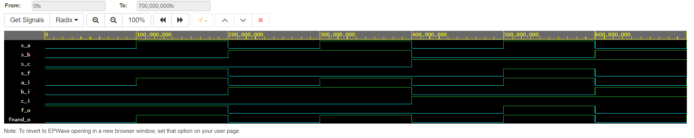
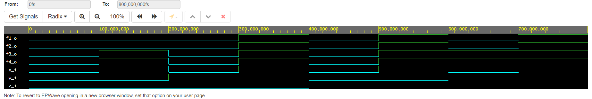

# Ondřej Smola, 217628 - gates (úkol č.1)

## 1st part - Link to my GitHub repository

[My GitHub repository](https://github.com/smolao/Digital-electronics-1)

## 2nd part De Morgan's laws verification and simulation

### De Morgan's laws equations


### Table of functions values of set variables

| **c** | **b** |**a** | **f(c,b,a)** |
| :-: | :-: | :-: | :-: |
| 0 | 0 | 0 | 1 |  
| 0 | 0 | 1 | 1 |   
| 0 | 1 | 0 | 0 |   
| 0 | 1 | 1 | 0 |  
| 1 | 0 | 0 | 0 |   
| 1 | 0 | 1 | 1 |   
| 1 | 1 | 0 | 0 |    
| 1 | 1 | 1 | 0 |

### Source code from design.vhd of Architecture

```vhdl
------------------------------------------------------------------------
-- Architecture body for basic gates
------------------------------------------------------------------------
architecture dataflow of gates is
begin
    f_o  <= ((not b_i) and a_i) or ((not c_i) and (not b_i));
    fnand_o <= not(not((not b_i) and a_i) and not((not c_i) and (not b_i)));
    f_nor <= not(b_i or (not a_i)) or not(c_i or b_i);
    
end architecture dataflow;
```

### Screenshot of simulated waweforms of f, fnand and fnor, to see if they match


### Link to my EDA playground of De Morgan's laws
[De Morgan's Laws EDA Playground](https://www.edaplayground.com/x/fih9)

## 3rd part verification of Distributive laws

### Table of functions values of set variables

| **z** | **y** |**x** | **f(z,y,x)** |
| :-: | :-: | :-: | :-: | 
| 0 | 0 | 0 | 1 |  
| 0 | 0 | 1 | 1 |   
| 0 | 1 | 0 | 0 |   
| 0 | 1 | 1 | 0 |  
| 1 | 0 | 0 | 0 |   
| 1 | 0 | 1 | 1 |   
| 1 | 1 | 0 | 0 |    
| 1 | 1 | 1 | 0 |

### Source code from design.vhd of Architecture
```vhdl
------------------------------------------------------------------------
-- Architecture body for basic gates
------------------------------------------------------------------------
--Distributive laws equations and its functions
architecture dataflow of gates is
begin
    f1_o <= (x_i and y_i) or (x_i and z_i);
    f2_o <= x_i and (y_i or z_i);
    f3_o <= (x_i or y_i) and (x_i or z_i);
    f4_o <= x_i or (y_i and z_i);
    
end architecture dataflow;
```

### Screenshot of simulated time waweforms to see if f1=f2 and f3=f4, it does


### Link to my EDA Playground of Distributed laws
[Distributed laws EDA Playground](https://www.edaplayground.com/x/pqNw)