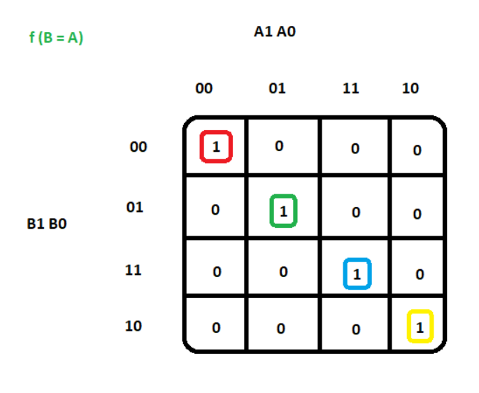
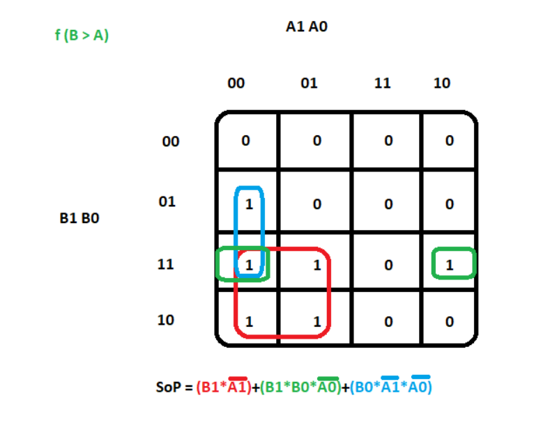
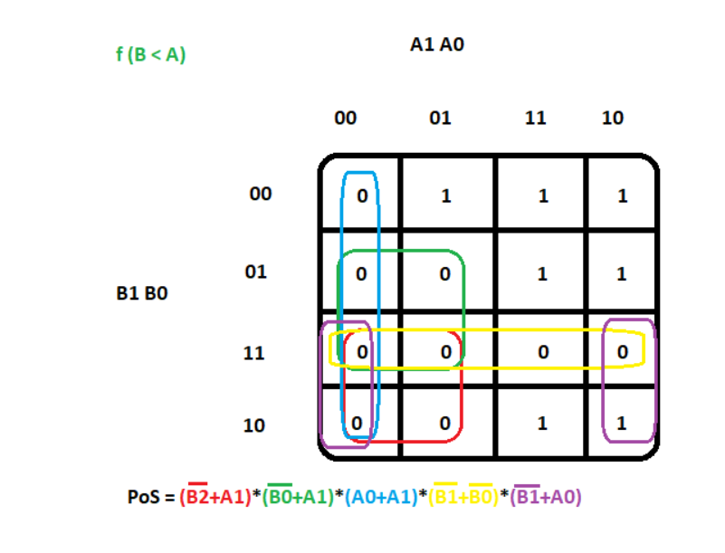
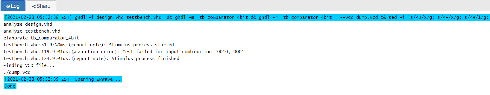
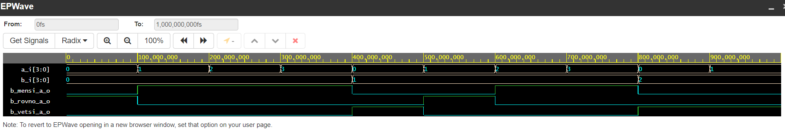

ss# 2nd task - Combinational logic (02-logic, Ondřej Smola - 217628)

## Link to my GitHub repository

[My GitHub 02-logic repository](https://github.com/smolao/Digital-electronics-1/tree/main/Labs/02-logic)

## 1st part - Binary comparator truth table

| **Dec. equivalent** | **B[1:0]** | **A[1:0]** | **B is greater than A** | **B equals A** | **B is less than A** |
| :-: | :-: | :-: | :-: | :-: | :-: |
| 0 | 0 0 | 0 0 | 0 | 1 | 0 |
| 1 | 0 0 | 0 1 | 0 | 0 | 1 |
| 2 | 0 0 | 1 0 | 0 | 0 | 1 |
| 3 | 0 0 | 1 1 | 0 | 0 | 1 |
| 4 | 0 1 | 0 0 | 1 | 0 | 0 |
| 5 | 0 1 | 0 1 | 0 | 1 | 0 |
| 6 | 0 1 | 1 0 | 0 | 0 | 1 |
| 7 | 0 1 | 1 1 | 0 | 0 | 1 |
| 8 | 1 0 | 0 0 | 1 | 0 | 0 |
| 9 | 1 0 | 0 1 | 1 | 0 | 0 |
| 10 | 1 0 | 1 0 | 0 | 1 | 0 |
| 11 | 1 0 | 1 1 | 0 | 0 | 1 |
| 12 | 1 1 | 0 0 | 1 | 0 | 0 |
| 13 | 1 1 | 0 1 | 1 | 0 | 0 |
| 14 | 1 1 | 1 0 | 1 | 0 | 0 |
| 15 | 1 1 | 1 1 | 0 | 1 | 0 |

## 2nd part 2-bit comparator

### 1st function f(B=A)



### 2nd function f(B>A)



### 3rd function f(B<A)



## 3rd part 4-bit binary comparator

### design.vhd

```vhdl
------------------------------------------------------------------------
-- Entity declaration for 4-bit binary comparator
------------------------------------------------------------------------
entity comparator_4bit is
	port(
    	a_i			: in std_logic_vector(4 - 1 downto 0);
        b_i			: in std_logic_vector(4 - 1 downto 0);
        
        -- COMPLETE ENTITY DECLARATION
        
        B_vetsi_A_o 	: out std_logic;	--B is greater than A
        B_rovno_A_o		: out std_logic;	--B equals A
        B_mensi_A_o		: out std_logic		--B is less than A
        );
end entity comparator_4bit;

------------------------------------------------------------------------
-- Architecture body for 4-bit binary comparator
------------------------------------------------------------------------
architecture behavioral of comparator_4bit is
begin
	B_mensi_A_o	<= '1' when (b_i < a_i) else '0';
    B_rovno_A_o <= '1' when (b_i = a_i) else '0';
    B_vetsi_A_o <= '1' when (b_i > a_i) else '0';
    
    end architecture behavioral;
```

### testbench.vhd
```vhdl
------------------------------------------------------------------------
-- Entity declaration for testbench
------------------------------------------------------------------------
entity tb_comparator_4bit is
    -- Entity of testbench is always empty
end entity tb_comparator_4bit;

------------------------------------------------------------------------
-- Architecture body for testbench
------------------------------------------------------------------------
architecture testbench of tb_comparator_4bit is

	-- Local signals
    signal s_a			: std_logic_vector(4 - 1 downto 0);
    signal s_b			: std_logic_vector(4 - 1 downto 0);
    signal s_B_vetsi_A  : std_logic;
    signal s_B_rovno_A  : std_logic;
    signal s_B_mensi_A  : std_logic;

begin
    -- Connecting testbench signals with 4bit_comparator entity (Unit Under Test)
    uut_comparator_4bit : entity work.comparator_4bit
    	port map(
        	a_i				=> s_a,
            b_i				=> s_b,
            B_vetsi_A_o		=> s_B_vetsi_A,
            B_rovno_A_o		=> s_B_rovno_A,
            B_mensi_A_o		=> s_B_mensi_A
            );
    
    --------------------------------------------------------------------
    -- Data generation process
    --------------------------------------------------------------------
    p_stimulus : process
    begin
    	--Report a note at the begining of stimulus process
        report "Stimulus process started" severity note;
        
        --First test values
        s_b <= "0000"; s_a <= "0000"; wait for 100 ns;
        --Expected output
       assert ((s_B_vetsi_A = '0') and (s_B_rovno_A = '1') and (s_B_mensi_A = '0'))
       --If false, then report an error
       report "Test failed for input combination: 0000, 0000" severity error;
       
       -- Second test values
		s_b <= "0000"; s_a <= "0001"; wait for 100 ns;
        -- Expected output
        assert ((s_B_vetsi_A = '0') and (s_B_rovno_A = '0') and (s_B_mensi_A = '1'))
        -- If false, then report an error
        report "Test failed for input combination: 0000, 0001" severity error;
        
        -- Third test values
        s_b <= "0000"; s_a <= "0010"; wait for 100 ns;
        -- Expected output
        assert ((s_B_vetsi_A = '0') and (s_B_rovno_A = '0') and (s_B_mensi_A = '1'))
        -- If false, then report an error
        report "Test failed for input combination: 0000, 0010" severity error;
        
        -- 4th test values
        s_b <= "0000"; s_a <= "0011"; wait for 100 ns;
        -- Expected output
        assert ((s_B_vetsi_A = '0') and (s_B_rovno_A = '0') and (s_B_mensi_A = '1'))
        -- If false, then report an error
        report "Test failed for input combination: 0000, 0011" severity error;
        
        -- 5th test values
        s_b <= "0001"; s_a <= "0000"; wait for 100 ns;
        -- Expected output
        assert ((s_B_vetsi_A = '1') and (s_B_rovno_A = '0') and (s_B_mensi_A = '0'))
        -- If false, then report an error
        report "Test failed for input combination: 0001, 0000" severity error;
        
        -- 6th test values
        s_b <= "0001"; s_a <= "0001"; wait for 100 ns;
        -- Expected output
        assert ((s_B_vetsi_A = '0') and (s_B_rovno_A = '1') and (s_B_mensi_A = '0'))
        -- If false, then report an error
        report "Test failed for input combination: 0001, 0001" severity error;
        
        -- 7th test values
        s_b <= "0001"; s_a <= "0010"; wait for 100 ns;
        -- Expected output
        assert ((s_B_vetsi_A = '0') and (s_B_rovno_A = '0') and (s_B_mensi_A = '1'))
        -- If false, then report an error
        report "Test failed for input combination: 0001, 0010" severity error;
        
        -- 8th test values
        s_b <= "0001"; s_a <= "0011"; wait for 100 ns;
        -- Expected output
        assert ((s_B_vetsi_A = '0') and (s_B_rovno_A = '0') and (s_B_mensi_A = '1'))
        -- If false, then report an error
        report "Test failed for input combination: 0001, 0011" severity error;
        
        -- 9th test values
        s_b <= "0010"; s_a <= "0000"; wait for 100 ns;
        -- Expected output
        assert ((s_B_vetsi_A = '1') and (s_B_rovno_A = '0') and (s_B_mensi_A = '0'))
        -- If false, then report an error
        report "Test failed for input combination: 0010, 0000" severity error;
        
         -- 10th test values - INTENTIONAL ERROR
        s_b <= "0010"; s_a <= "0001"; wait for 100 ns;
        -- Expected output
        assert ((s_B_vetsi_A = '1') and (s_B_rovno_A = '1') and (s_B_mensi_A = '0'))
        -- If false, then report an error
        report "Test failed for input combination: 0010, 0001" severity error;
        
        -- Report a note at the end of stimulus process
        report "Stimulus process finished" severity note;
        wait;
    end process p_stimulus;
    
end architecture testbench;
```
### Screenshots of reported error message and simulated waweforms from EDA





### Link to my EDA playground (4-bit comparator simulation)

[My EDA Playground 4-bit comparator simulation](https://www.edaplayground.com/x/Vs4y)