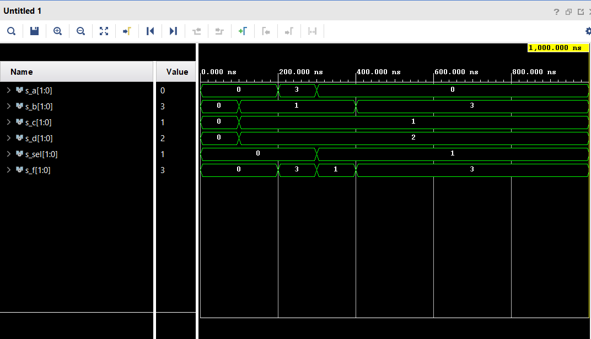

# 3rd task - Vivado (Ondřej Smola - 217628)

## 1st Preparation task

## 2nd Two-bit wide 4-to-1 multiplexer

### Listing of VHDL architecture from source file

```vhdl
architecture Behavioral of mux_2bit_4to1 is
begin
    f_o <= a_i when (sel_i = "00") else
           b_i when (sel_i = "01") else
           c_i when (sel_i = "10") else
           d_i;       

    -- WRITE "GREATER" AND "EQUALS" ASSIGNMENTS HERE

end architecture Behavioral;
```

### Listing od VHDL stimulus process from testbench file

```vhdl
p_stimulus : process
    begin
        -- Report a note at the beginning of stimulus process
        report "Stimulus process started" severity note;


        -- First test values
        s_d <= "00"; s_c <= "00"; s_b <= "00"; s_a <= "00"; 
        s_sel <= "00"; wait for 100 ns;
        
        s_d <= "10"; s_c <= "01"; s_b <= "01"; s_a <= "00"; 
        s_sel <= "00"; wait for 100 ns;
        
        s_d <= "10"; s_c <= "01"; s_b <= "01"; s_a <= "11"; 
        s_sel <= "00"; wait for 100 ns;
        
        s_d <= "10"; s_c <= "01"; s_b <= "01"; s_a <= "00"; 
        s_sel <= "01"; wait for 100 ns;
        
        s_d <= "10"; s_c <= "01"; s_b <= "11"; s_a <= "00"; 
        s_sel <= "01"; wait for 100 ns;
        -- WRITE OTHER TEST CASES HERE


        -- Report a note at the end of stimulus process
        report "Stimulus process finished" severity note;
        wait;
    end process p_stimulus;
```

### Screenshot with simulated time waweforms


## 3rd Task - Link to my README file with Vivado Tutorial

[My Vivado tutorial](https://github.com/smolao/Digital-electronics-1/blob/main/Labs/03-vivado/README3_tutorial.md)