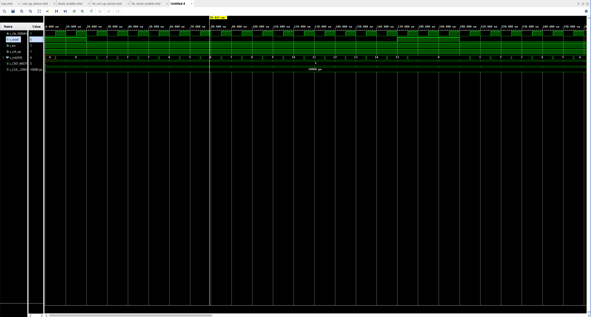
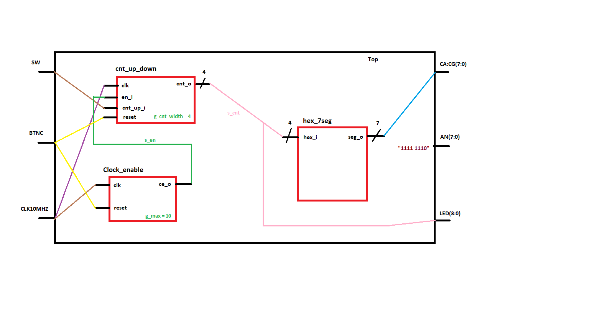
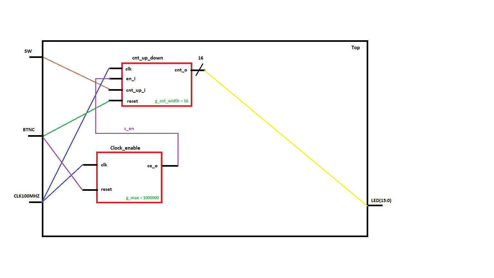

# Lab 5 - Binary Counter (Ondřej Smola - 217628)

## 1st - Preparation task

### Table with connection of push buttons on Nexys A7 board


| **Button** | **Pin** |
| :-: | :-: |
| BTNL | P17 |
| BTNR | M17 |
| BTNU | M18 |   
| BTND | P18 |
| BTNC | N17 |


### Table of calculated values

| **Time interval** | **Number of clk periods** | **Number of clk periods in hex** | **Number of clk periods in binary** |
| :-: | :-: | :-: | :-: |
| 2 ms | 200000 | x"3_0d40" | b"0011_0000_1101_0100_0000" |
| 4 ms | 400000 | x"6_1A80" | b"0110_0001_1010_1000_0000"|
| 10 ms | 1000000 | x"F_4240" | b"1111_0100_0010_0100_0000" |
| 250 ms | 25000000 | x"17D_7840 | b"0001_0111_1101_0111_1000_0100_0000" |
| 500 ms | 50000000 | x"2FA_F080" | b"0010_1111_1010_1111_0000_1000_0000" |
| 1 sec | 100000000 | x"5F5_E100" | b"0101_1111_0101_1110_0001_0000_0000" |

## 2nd - Bidirectional counter

### Listing of VHDL code of the process (p_cnt_up_down)

```vhdl
p_cnt_up_down : process(clk)
    begin
        if rising_edge(clk) then
        
            if (reset = '1') then               -- Synchronous reset
                s_cnt_local <= (others => '0'); -- Clear all bits

            elsif (en_i = '1') then       -- Test if counter is enabled
            s_cnt_local <= s_cnt_local + 1;

            elsif (cnt_up_i = '1') then
            s_cnt_local <= s_cnt_local - 1;
            
            end if;
        end if;
    end process p_cnt_up_down;
```

### Listing of VHDL reset and stimulus process from testbench (tb_cnt_up_down.vhd)

#### Reset process

```vhdl
p_reset_gen : process
    begin
        s_reset <= '1';
        wait for 20 ns;
        
        s_reset <= '0';
        wait for 150 ns;

        -- Reset activated
        s_reset <= '1';
        wait for 30 ns;
        
        assert ((s_cnt = "00000") and (s_cnt_up = '1') and (s_reset = '1'))
        report "Test failed for input combination: 0, 1, 1" severity error;
        
        s_reset <= '0';
        wait;
        
    end process p_reset_gen;
```

#### Stimulus process

```vhdl
p_stimulus : process
    begin
        report "Stimulus process started" severity note;

        -- Enable counting
        s_en     <= '1';
        
        -- Change counter direction
        s_cnt_up <= '1';
        wait for 380 ns;
        
        assert ((s_cnt = "10010") and (s_cnt_up = '1') and (s_reset = '0'))
        report "Test failed for input combination: 18, 1, 0" severity error;
        
        s_cnt_up <= '0';
        wait for 220 ns;
        
        assert ((s_cnt = "11100") and (s_cnt_up = '0') and (s_reset = '0'))
        report "Test failed for input combination: 28, 0, 0" severity error;

        -- Disable counting
        s_en     <= '0';

        report "Stimulus process finished" severity note;
        wait;
    end process p_stimulus;
```

### Screenshot of simulated waweforms



## 3rd - Top level

### Listing of VHDL code of top.vhd

```vhdl
--------------------------------------------------------------------
    -- Instance (copy) of clock_enable entity
    clk_en0 : entity work.clock_enable
        generic map(
            g_MAX => 100000000
            
            
        )
        port map
        (
            clk   => CLK100MHZ,
            reset => BTNC,
            ce_o  => s_en
        );

    --------------------------------------------------------------------
    -- Instance (copy) of cnt_up_down entity
    bin_cnt0 : entity work.cnt_up_down
        generic map(
            g_CNT_Width => 4
        )
        port map
        (
            clk       => CLK100MHZ,
            reset     => BTNC,
            en_i      => s_en,
            cnt_up_i  => SW(0),
            cnt_o     => s_cnt
        );

    -- Display input value on LEDs
    LED(3 downto 0) <= s_cnt;

    --------------------------------------------------------------------
    -- Instance (copy) of hex_7seg entity
    hex2seg : entity work.hex_7seg
        port map(
            hex_i    => s_cnt,
            seg_o(6) => CA,
            seg_o(5) => CB,
            seg_o(4) => CC,
            seg_o(3) => CD,
            seg_o(2) => CE,
            seg_o(1) => CF,
            seg_o(0) => CG
        );
```

### Images of the top layer including both counters



