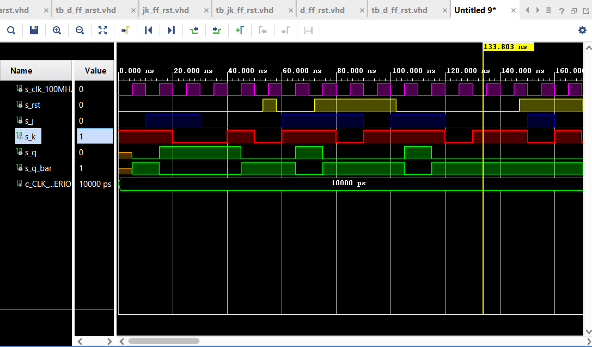

# Lab 7 - Latches and Flip-flops (Ondřej Smola - 217628)

## 1st part - Preparation task

### D flip-flop

| *D* | *Qn* | *Q(n+1)* | *Comments* |
   | :-: | :-: | :-: | :-- |
   | 0 | 0 | 0 | No Change |
   | 0 | 1 | 0 | Reset |
   | 1 | 0 | 1 | Set |
   | 1 | 1 | 1 | No Change |

### JK flip-flop

   | *J* | *K* | *Qn* | *Q(n+1)* | *Comments* |
   | :-: | :-: | :-: | :-: | :-- |
   | 0 | 0 | 0 | 0 | No change |
   | 0 | 0 | 1 | 1 | No change |
   | 0 | 1 | 0 | 0 | Reset |
   | 0 | 1 | 1 | 0 | Reset |
   | 1 | 0 | 0 | 1 | Set |
   | 1 | 0 | 1 | 1 | Set |
   | 1 | 1 | 0 | 1 | Toggle |
   | 1 | 1 | 1 | 0 | Toggle |
   
   ### T flip-flop
   
   | *T* | *Qn* | *Q(n+1)* | *Comments* |
   | :-: | :-: | :-: | :-- |
   | 0 | 0 | 0 | No change |
   | 0 | 1 | 1 | No change |
   | 1 | 0 | 1 | Invert |
   | 1 | 1 | 0 | Invert |

## 2nd part - D latch

### Listing of VHDL code of the process p_d_latch

```vhdl
p_d_latch : process(d, arst, en)
        begin
            if (arst = '1') then
                q     <= '0';
                q_bar <= '1';
            
            elsif (en = '1') then
                q     <= d;
                q_bar <= not d;
           
            end if; 
            
    end process p_d_latch;
```

### Listing of VHDL reset and stimulus process from testbench tb_d_latch

```vhdl
p_reset_gen : process
    begin
        s_arst <= '0';
        wait for 53 ns;
        
        -- Reset activated
        s_arst <= '1';
        wait for 5 ns;
        
        -- Reset deactivated
        s_arst <= '0';
        
        wait for 108  ns;
        s_arst <= '1';
        
        wait for 30 ns;
        s_arst <= '0';
        
        wait;
    end process p_reset_gen;

    --------------------------------------------------------------------
    -- Data generation process
    --------------------------------------------------------------------
   
    p_stimulus : process
    begin
        report "Stimulus process started" severity note;
        
        s_en  <= '0';
        s_d   <= '0';
        
        assert (s_q = '0')
        report "report" severity error;
        
        wait for 10 ns;
        s_d <= '1';
        wait for 10 ns;
        s_d <= '0';
        wait for 10 ns;
        s_d <= '1';
        wait for 10 ns;
        s_d <= '0';
        wait for 10 ns;
        s_d <= '1';
        wait for 10 ns;
        s_d <= '0';
        wait for 10 ns;
        
        s_en <= '1';
        
        wait for 3 ns;
        assert (s_d = '0' and s_arst = '0' and s_en = '1')
        report "Test failed for input combination: d='0', arst='0', en='1'." severity error;
        
        wait for 7 ns;
        s_d <= '0';
        wait for 10 ns;
        s_d <= '1';
        wait for 10 ns;
        s_d <= '0';
        
        wait for 3 ns;
        assert (s_d = '1' and s_arst = '0' and s_en = '1')
        report "Test failed for input combination: d='1', arst='0', en='1'." severity error;
        
        wait for 7 ns;
        s_d <= '0';
        wait for 10 ns;
        s_d <= '1';
        wait for 10 ns;
        s_d <= '0';
        wait for 10 ns;
        
        s_en <= '0';
        
        wait for 3ns;
        assert(s_d = '0' and  s_arst = '0' and s_en = '0')
        report "Test failed for input combination: d='0', arst='0', en='0'." severity error;

        wait for 7 ns;
        s_d <= '1';
        wait for 10 ns;
        
        s_en <= '1';
       
        s_d  <= '0';
        wait for 10ns;
        s_d  <= '1';
        
        wait for 3ns;
        assert(s_d = '1' and  s_arst = '1' and s_en = '1')
        report "Test failed for input combination: d='1', arst='1', en='1'." severity error;
        
        wait for 7ns;
        s_d  <= '0';
        wait for 10ns;
        s_d  <= '1';
        
        s_en <= '0';
        
        wait for 10ns;
        s_d  <= '0';
        wait for 10ns;
        
        s_en <= '1';
        
        wait for 10ns;
        s_d  <= '1';
        wait for 10ns;
        s_d  <= '0';
        wait for 10ns;
        
        s_en <= '0';
        
        s_d  <= '1';
        wait for 10ns;
        s_d  <= '0';
        wait for 10ns;
        
        s_en <= '1';
        
        s_d  <= '1';
        wait for 10ns;
        s_d  <= '0';
        wait for 10ns;
        
        s_en <= '0';
        
        report "Stimulus procces finished" severity note;
        wait;
    end process p_stimulus;
```

### Screenshot of simulated waweforms


## 3rd part - Flip-flops

### 1) Listing of VHDL code of the process p_d_ff_arst
```vhdl
p_d_ff_arst : process(clk, arst)
        begin
            if (arst = '1') then
                q     <= '0';
                q_bar <= '1';
            
            elsif rising_edge(clk) then
                q     <= d;
                q_bar <= not d;
           
            end if; 
            
    end process p_d_ff_arst;
```

### Listing of VHDL clock, reset and stimulus from testbench tb_d_ff_arst
```vhdl
p_clk_gen : process
    begin
        while now < 750 ns loop         -- 75 periods of 100MHz clock
            s_clk_100MHz <= '0';
            wait for c_CLK_100MHZ_PERIOD / 2;
            s_clk_100MHz <= '1';
            wait for c_CLK_100MHZ_PERIOD / 2;
        end loop;
        wait;
    end process p_clk_gen;
    
    
    p_reset_gen : process
    begin
        s_arst <= '0';
        wait for 53ns;
        
        s_arst <= '1';
        wait for 5ns;
        
        s_arst <= '0';
        
        wait for 14ns;
        s_arst <= '1';
        
        wait for 30ns;
        s_arst <= '0';
        
        wait for 45ns;
        s_arst <= '1';
        
        wait for 30ns;
        s_arst <= '0';
        
        wait;
    end process p_reset_gen;

     p_stimulus : process
    begin
        report "Stimulus process started" severity note;
        s_d  <= '0';
        
        wait for 10ns;
        s_d  <= '1';
        wait for 10ns;
        s_d  <= '0';
        wait for 10ns;
        s_d  <= '1';
        wait for 10ns;
        s_d  <= '0';
        wait for 10ns;
        s_d  <= '1';
        wait for 10ns;
        s_d  <= '0';
        wait for 10ns;
        
        wait for 3ns;
        assert(s_d = '0' and  s_arst = '1' and s_q = '0')
        report "Test failed for input combination: d='0', arst='1', s_q = '0'." severity error;
        
        wait for 7ns;
        s_d  <= '1';
        wait for 10ns;
        s_d  <= '0';
        wait for 10ns;
        s_d  <= '1';
        
        wait for 3ns;
        assert(s_d = '1' and  s_arst = '0' and s_q = '0')
        report "Test failed for input combination: d='1', arst='0', s_q = '0'." severity error;
        
        wait for 7ns;
        s_d  <= '0';
        wait for 10ns;
        s_d  <= '1';
        wait for 10ns;
        s_d  <= '0';
        wait for 10ns;
        
        wait for 3ns;
        assert(s_d = '0' and  s_arst = '0' and s_q = '0')
        report "Test failed for input combination: d='0', arst='0', s_q='0'." severity error;
        
        wait for 7ns;
        s_d  <= '1';
        wait for 10ns;
        
        s_d  <= '0';
        wait for 10ns;
        s_d  <= '1';
        
        wait for 3ns;
        assert(s_d = '1' and  s_arst = '1' and s_q = '0')
        report "Test failed for input combination: d='1', arst='1', s_q='0'." severity error;
        
        report "Stimulus process finished" severity note;
        wait;
    end process p_stimulus;
```

### Screenshot of waweforms of d_ff_arst


### 2) Listing of VHDL code of the process p_d_ff_rst

```vhdl
p_d_ff_rst : process(clk)
    begin
        if rising_edge(clk) then         
            if(rst = '1') then
                q       <= '0';
                q_bar   <= '1';
            else
                q       <= d;
                q_bar   <= not d;
            end if;    
        end if;
    end process p_d_ff_rst;
```

### Listing of VHDL clock, reset and stimulus from testbench td_d_ff_rst
```vhdl
p_clk_gen : process
    begin
        while now < 750 ns loop         -- 75 periods of 100MHz clock
            s_clk_100MHz <= '0';
            wait for c_CLK_100MHZ_PERIOD / 2;
            s_clk_100MHz <= '1';
            wait for c_CLK_100MHZ_PERIOD / 2;
        end loop;
        wait;
    end process p_clk_gen;
    
    
    p_reset_gen : process
    begin
        s_rst <= '0';
        wait for 53ns;
        
        s_rst <= '1';
        wait for 5ns;
        
        s_rst <= '0';
        
        wait for 14ns;
        s_rst <= '1';
        
        wait for 30ns;
        s_rst <= '0';
        
        wait for 45ns;
        s_rst <= '1';
        
        wait for 30ns;
        s_rst <= '0';
        
        wait;
    end process p_reset_gen;

     p_stimulus : process
    begin
        report "Stimulus process started" severity note;
        s_d  <= '0';
        
        wait for 10ns;
        s_d  <= '1';
        wait for 10ns;
        s_d  <= '0';
        wait for 10ns;
        s_d  <= '1';
        wait for 10ns;
        s_d  <= '0';
        wait for 10ns;
        s_d  <= '1';
        wait for 10ns;
        s_d  <= '0';
        wait for 10ns;
        
        wait for 3ns;
        assert(s_d = '0' and  s_rst = '1' and s_q = '0')
        report "Test failed for input combination: d='0', rst='1', s_q = '0'." severity error;
        
        wait for 7ns;
        s_d  <= '1';
        wait for 10ns;
        s_d  <= '0';
        wait for 10ns;
        s_d  <= '1';
        
        wait for 3ns;
        assert(s_d = '1' and  s_rst = '0' and s_q = '0')
        report "Test failed for input combination: d='1', rst='0', s_q = '0'." severity error;
        
        wait for 7ns;
        s_d  <= '0';
        wait for 10ns;
        s_d  <= '1';
        wait for 10ns;
        s_d  <= '0';
        wait for 10ns;
        
        wait for 3ns;
        assert(s_d = '0' and  s_rst = '0' and s_q = '0')
        report "Test failed for input combination: d='0', rst='0', s_q='0'." severity error;
        
        wait for 7ns;
        s_d  <= '1';
        wait for 10ns;
        
        s_d  <= '0';
        wait for 10ns;
        s_d  <= '1';
        
        wait for 3ns;
        assert(s_d = '1' and  s_rst = '1' and s_q = '0')
        report "Test failed for input combination: d='1', rst='1', s_q='0'." severity error;
        
        report "Stimulus process finished" severity note;
        wait;
    end process p_stimulus;
```

### Screenshot of simulated waweforms


### 3) Listing of VHDL code of the process p_jk_ff_rst

```vhdl
p_jk_ff_rst : process(clk)
        begin
            if rising_edge(clk) then
                if (rst = '1') then
                    s_q <= '0';
                    else
                        if (j = '0' and k = '0') then
                            s_q <= s_q;
                        elsif (j = '0' and k = '1') then
                            s_q <= '0';
                        elsif (j = '1' and k = '0') then
                            s_q <= '1';
                        elsif (j = '1' and k = '1') then
                            s_q <= not s_q;
                        end if;
                        
                end if;
                
            end if;
            
    end process p_jk_ff_rst;
```

### Listing of VHDL clock, reset and stimulus from testbench td_jk_ff_rst

```vhdl
p_clk_gen : process
    begin
        while now < 750 ns loop         -- 75 periods of 100MHz clock
            s_clk_100MHz <= '0';
            wait for c_CLK_100MHZ_PERIOD / 2;
            s_clk_100MHz <= '1';
            wait for c_CLK_100MHZ_PERIOD / 2;
        end loop;
        wait;
    end process p_clk_gen;
    
    
    p_reset_gen : process
    begin
        s_rst <= '0';
        wait for 53ns;
        
        s_rst <= '1';
        wait for 5ns;
        
        s_rst <= '0';
        
        wait for 14ns;
        s_rst <= '1';
        
        wait for 30ns;
        s_rst <= '0';
        
        wait for 45ns;
        s_rst <= '1';
        
        wait for 30ns;
        s_rst <= '0';
        
        wait;
    end process p_reset_gen;

     p_stimulus : process
    begin
        report "Stimulus process started" severity note;
        s_j  <= '0';
        s_k  <= '1';
        
        wait for 10ns;
        s_j  <= '1';
        s_k  <= '1';
        wait for 10ns;
        s_j  <= '1';
        s_k  <= '0';
        wait for 10ns;
        s_j  <= '0';
        s_k  <= '0';
        wait for 10ns;
        s_j  <= '0';
        s_k  <= '1';
        wait for 10ns;
        s_j  <= '0';
        s_k  <= '0';
        wait for 10ns;
        s_j  <= '1';
        s_k  <= '1';
        wait for 10ns;
        
        wait for 3ns;
        assert(s_rst = '1' and s_q = '1' and s_j = '1' and s_k = '1')
        report "Test failed for input combination: rst='1', s_q = '1', j='1', k = '1'." severity error;
        
        wait for 7ns;
        s_j  <= '1';
        s_k  <= '0';
        wait for 10ns;
        s_j  <= '0';
        s_k  <= '1';
        wait for 10ns;
        s_j  <= '1';
        s_k  <= '1';
        
        wait for 3ns;
        assert(s_rst = '0' and s_q = '0' and s_j = '1' and s_k = '1')
        report "Test failed for input combination: rst='0', s_q = '0', j='1', k = '1'." severity error;
        
        wait for 7ns;
        s_j  <= '1';
        s_k  <= '1';
        wait for 10ns;
        s_j  <= '0';
        s_k  <= '0';
        wait for 10ns;
        s_j  <= '0';
        s_k  <= '1';
        wait for 10ns;
        
        wait for 3ns;
        assert(s_rst = '0' and s_q = '0' and s_j = '0' and s_k = '1')
        report "Test failed for input combination: rst='0', s_q = '0', j='0', k = '1'." severity error;
        
        wait for 7ns;
        s_j  <= '1';
        s_k  <= '0';
        wait for 10ns;
        
        s_j  <= '0';
        s_k  <= '1';
        wait for 10ns;
        s_j  <= '0';
        s_k  <= '0';
        
        wait for 3ns;
        assert(s_rst = '1' and s_q = '0' and s_j = '0' and s_k = '0')
        report "Test failed for input combination: rst='1', s_q = '0', j='0', k = '0'." severity error;
        
        report "Stimulus process finished" severity note;
        wait;
    end process p_stimulus;
```
### Screenshot of simulated waweforms



### 4) Listing of VHDL code of the process p_t_ff_rst

```vhdl
p_t_ff_rst : process(clk)
    begin
        if rising_edge(clk) then 
           if (rst = '1') then        
              s_q <= '0';
           else               
              if (t = '0') then
                    s_q  <= s_q;                                     
              else
                    s_q  <= not s_q;  
              end if;            
           end if;           
        end if;       
                                 
    end process p_t_ff_rst;
```

### Listing of VHDL clock, reset and stimulus from testbench td_t_ff_rst

```vhdl
p_clk_gen : process
    begin
        while now < 750 ns loop         -- 75 periods of 100MHz clock
            s_clk_100MHz <= '0';
            wait for c_CLK_100MHZ_PERIOD / 2;
            s_clk_100MHz <= '1';
            wait for c_CLK_100MHZ_PERIOD / 2;
        end loop;
        wait;
    end process p_clk_gen;
    
    p_reset_gen : process
    begin
        s_rst <= '0';
        wait for 53ns;
        
        s_rst <= '1';
        wait for 5ns;
        
        s_rst <= '0';
        
        wait for 14ns;
        s_rst <= '1';
        
        wait for 30ns;
        s_rst <= '0';
        
        wait for 45ns;
        s_rst <= '1';
        
        wait for 30ns;
        s_rst <= '0';
        
        wait;
    end process p_reset_gen;

     p_stimulus : process
    begin
        report "Stimulus process started" severity note;
        s_t  <= '0';
        
        wait for 10ns;
        s_t  <= '1';
        wait for 10ns;
        s_t  <= '0';
        wait for 10ns;
        s_t  <= '1';
        wait for 10ns;
        s_t  <= '0';
        wait for 10ns;
        s_t  <= '1';
        wait for 10ns;
        s_t  <= '0';
        wait for 10ns;
        
        wait for 3ns;
        assert(s_rst = '1' and  s_q = '0' and s_t = '0')
        report "Test failed for input combination: rst='1', q='0', t = '0'." severity error;
        
        wait for 7ns;
        s_t  <= '1';
        wait for 10ns;
        s_t  <= '0';
        wait for 10ns;
        s_t  <= '1';
        
        wait for 3ns;
        assert(s_rst = '0' and  s_q = '0' and s_t = '1')
        report "Test failed for input combination: rst='0', q='0', t = '1'." severity error;
        
        wait for 7ns;
        s_t  <= '0';
        wait for 10ns;
        s_t  <= '1';
        wait for 10ns;
        s_t  <= '0';
        wait for 10ns;
        
        wait for 3ns;
        assert(s_rst = '0' and  s_q = '0' and s_t = '0')
        report "Test failed for input combination: rst='0', q='0', t = '0'." severity error;
        
        wait for 7ns;
        s_t  <= '1';
        wait for 10ns;
        
        s_t  <= '0';
        wait for 10ns;
        s_t  <= '1';
        
        wait for 3ns;
        assert(s_rst = '1' and  s_q = '0' and s_t = '1')
        report "Test failed for input combination: rst='1', q='0', t = '1'." severity error;
        
        report "Stimulus process finished" severity note;
        wait;
    end process p_stimulus;
```

### Screenshot of simulated waweforms


## 4th part - Shift register


